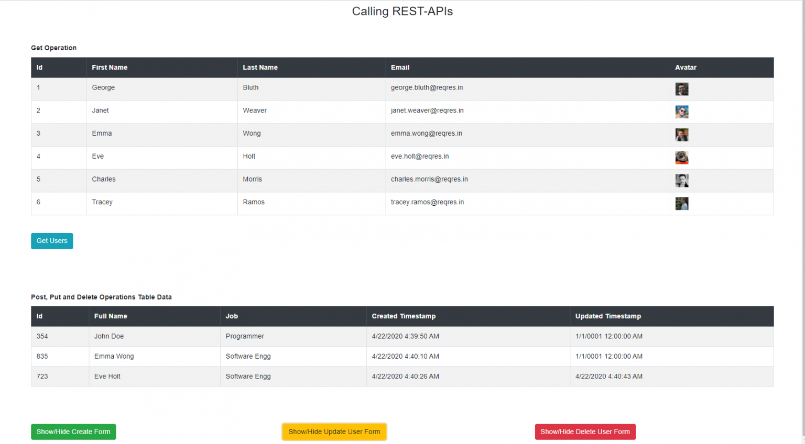

# blazorservercrudwithrestapi

Sample project - for consuming REST API in Blazor Server Application using the .NET Frameworks HttpClient class, and will cover how to invoke GET, POST, PUT and DELETE APIs and display the method responses using an HTML table

